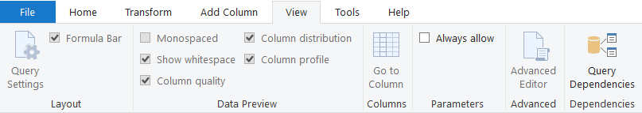

# Power BI

<a href="https://docs.microsoft.com/en-us/power-bi/">Microsoft Power BI</a> | <a href="https://docs.microsoft.com/en-us/dax/" target="_blank">DAX</a> | <a href="https://docs.microsoft.com/en-us/powerquery-m/" target="_blank">Power Query M</a>

### What is Power BI

- `BI`: Business Intelligence
- Analyze data to help businesses to make better business decisions.
- Power BI is Microsoft's Business Analytics Service + Self Service Business Intelligence Tool.
- Power BI `Desktop` is free and easy to use.
- Helps to get data ready for well presented analysis.

### Tables

<table>
  <tr><th>Data Table</th><th>Lookup Table</th></tr>
  <tr><td>Fact Table</td><td>Dimension Table</td></tr>  
  <tr><td>Contains measurable values.</td><td>Contains descriptive attributes.</td></tr>
  <tr><td>Quantity, Revenue, Sales Amount, Revenue, etc.</td><td>Product ID, Category, Sub Category, Customer Name, Age, etc.</td></tr>
  <tr><td>Many rows for one ID.</td><td>Only one row for one ID.</td></tr>
  <tr><td>Primary Keys + Foreign Keys</td><td>Only Primary Keys.</td></tr>
</table>

### Storage Mode

<table>
  <tr><th>Import</th><th>Direct Query</th></tr>
  <tr><td>Selected table and columns are imported in Power BI Desktop.</td><td>No data is imported in Power BI Desktop.</td></tr>
  <tr><td>Power BI Desktop uses the imported data to interact with the visualizations.</td><td>Power BI Desktop queries the live data source to interact with the visualizations. (Cloud Platform, Google Analytics, Database, etc.)</td></tr>
  <tr><td>Refreshing the data will reimport the entire dataset again.</td><td>Refreshing will be limited to the data source.</td></tr>
</table>

### Important Considerations 

`Direct Query` Mode is less suitable if :

- There is significant `load` time to get data from the back end source.
- A lot of users will use the reports.
- There are a lot of `RLS` row level security rules active on the dataset.

`Import` Mode limitations :

- `1GB` limit for datasets stored in shared capacities in a Power BI Service.
- Can only be refreshed `8` times a day by setting up a scheduled refresh.

### Calculated Columns 

- Calculated columns refers to entire `Table` or `Column`
- Calculated columns generated values for each `Row`
- The values are visible within tables in a `Data View`
- Calculated columns understand `Row Context`
- Calculated columns are typically use for `Filtering` data.
- Calculated columns are useless for creating any numerical values or aggregations (`SUM`, `AVERAGE`, `COUNT`, etc.)

### Data Preview

<table>
  <tr><th>Data</th><th>Column Quality</th><th>Column Distribution</th><th>Column Profiling</th></tr>
  <tr><td>Show Errors</td><td>:white_check_mark:</td><td>:x:</td><td>:white_check_mark:</td></tr>
  <tr><td>Show Valid Data</td><td>:white_check_mark:</td><td>:x:</td><td>:white_check_mark:</td></tr>
  <tr><td>Show Empty</td><td>:white_check_mark:</td><td>:x:</td><td>:white_check_mark:</td></tr>
  <tr><td>Show Unique</td><td>:x:</td><td>:white_check_mark:</td><td>:white_check_mark:</td></tr>
  <tr><td>Show Distinct</td><td>:x:</td><td>:white_check_mark:</td><td>:white_check_mark:</td></tr>
  <tr><td>Show Distribution</td><td>:x:</td><td>:white_check_mark:</td><td>:white_check_mark:</td></tr>
  <tr><td>Count</td><td>:x:</td><td>:x:</td><td>:white_check_mark:</td></tr>
  <tr><td>Show Min / Max</td><td>:x:</td><td>:x:</td><td>:white_check_mark:</td></tr>
  <tr><td>Show Avg</td><td>:x:</td><td>:x:</td><td>:white_check_mark:</td></tr>
</table>

### Unique vs Distinct

`Unique` : Value which appears only one time in the entire column 

`Distinct` : Unique value of all the categories in the entire column 

e.g. ( Apple, Mango, Grapes, Kiwi, Kiwi )  
- `Unique` Value : `3` ( Kiwi is not unique )
- `Distinct` Value : `4` ( Apple, Mango, Grapes, Kiwi )
